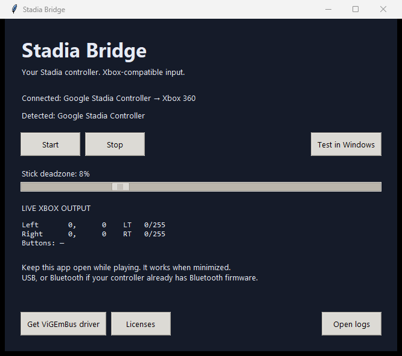

<div align="center">

# Stadia Bridge

### Put your Stadia controller back to work.

Use it as an **Xbox controller in Windows games**—with native XInput output.

[](https://github.com/adamdavies1915/stadia-bridge/actions/workflows/windows.yml)
[](https://github.com/adamdavies1915/stadia-bridge/releases/latest)

[](LICENSE)

**[⬇ Download StadiaBridge.exe](https://github.com/adamdavies1915/stadia-bridge/releases/latest/download/StadiaBridge.exe)**

One file. No Python installation. No extracting folders.

[All downloads](https://github.com/adamdavies1915/stadia-bridge/releases/latest) · [Report a problem](https://github.com/adamdavies1915/stadia-bridge/issues) · [Build from source](#build-from-source)



</div>

## Get playing in three steps

1. **Download and double-click [StadiaBridge.exe](https://github.com/adamdavies1915/stadia-bridge/releases/latest/download/StadiaBridge.exe).** Save it somewhere you want to keep it. The first launch may take a few seconds while it unpacks its bundled libraries.
2. **Install [ViGEmBus](https://github.com/nefarius/ViGEmBus/releases/latest) if you don't already have it.** This is the driver that creates the virtual Xbox controller. You only install it once. Restart Windows if its installer asks you to, then reopen Stadia Bridge.
3. **Connect your Stadia controller and play.** Use a USB data cable, or pair it through Windows Bluetooth settings if it already has Bluetooth firmware. The app connects automatically.

**Keep Stadia Bridge open while playing.** Minimized is fine. Closing it or pressing **Stop** removes the virtual Xbox controller.

Click **Test in Windows** in the app to see **Xbox 360 Controller for Windows** and check its controls. Open your game after the bridge connects.

> **Yes, ViGEmBus is still required.** Python and the app's libraries are bundled in the EXE; the Windows driver is separate. If it is already installed and working, you do not need to install it again. ViGEmBus is retired, so use the maintainer's linked release.

The executable is unsigned, so Windows may display an unknown-publisher warning. The release includes `SHA256SUMS.txt` for checking downloads.

### Which download do I want?

| Download | Use it when… |
| --- | --- |
| **[StadiaBridge.exe](https://github.com/adamdavies1915/stadia-bridge/releases/latest/download/StadiaBridge.exe)** | You just want to play. Download it and run it. |
| **[Portable Windows ZIP](https://github.com/adamdavies1915/stadia-bridge/releases/latest)** | You prefer an extracted app folder. Keep `_internal` beside the EXE. |
| **[EXE in this repository](downloads/StadiaBridge.exe)** | You want the checked-in beginner bundle. Click GitHub's download button on the file page. |
| Source archives | You want to inspect, modify, or rebuild the app or its LGPL dependency. |

## What it does

- **Native XInput:** compatible games see a virtual Xbox 360 controller.
- **Normal controls:** A/B/X/Y, D-pad, bumpers, stick clicks, both sticks, and independent analog triggers.
- **Automatic reconnect:** reconnecting the Stadia controller recreates the Xbox device.
- **Adjustable deadzone:** reduce stick drift with a slider.
- **Live output:** see what the bridge is sending to Windows.
- **Background operation:** input continues while the window is minimized.
- **One instance:** reopening the app won't create another Xbox controller.

```text
Stadia controller → Stadia Bridge → ViGEmBus → Xbox 360 / XInput → Your game
   USB / Bluetooth                  Windows driver
```

### Compatibility and limits

| Feature | Status |
| --- | --- |
| Windows | Windows 10/11, x64; verified on Windows 11 |
| Bluetooth | Verified with a real Stadia controller; Bluetooth firmware must already be installed |
| USB | Supported through SDL's Stadia mappings; hardware testing so far was over Bluetooth |
| Number of controllers | One Stadia controller per app instance |
| Xbox identity | Xbox 360, not Xbox One; ViGEmBus does not emulate an Xbox One device |
| Vibration / headset audio | Not forwarded |
| Assistant / Capture buttons | Not forwarded |
| Stadia / menu buttons | Guide and Start/Back where SDL and firmware support them; games or overlays may intercept Guide |

## Troubleshooting

| Problem | Try this |
| --- | --- |
| **Waiting for a controller** | Wake it, check Bluetooth pairing or the USB data cable, and look at the app's **Detected** list. |
| **Could not create Xbox controller** | Install ViGEmBus, restart if requested, and reopen the app. |
| **Game doesn't see it** | Click **Test in Windows** first, then restart the game after the bridge connects. |
| **Inputs happen twice** | Disable other controller translators. For a Steam game, try disabling Steam Input for that game while using this bridge. |
| **Stick drift** | Increase the stick deadzone slightly. |
| **Already running** | Use the existing Stadia Bridge window; check the taskbar if it is minimized. |
| **Need diagnostics** | Click **Open logs**. Logs are stored in `%LOCALAPPDATA%\StadiaBridge\bridge.log`. |

<details>
<summary><strong>Advanced: hide the physical controller if a game reads both devices</strong></summary>

Windows can show both the physical Stadia controller and the virtual Xbox controller. If a game still reads both after disabling other translators, [HidHide](https://github.com/nefarius/HidHide) can hide the physical device.

1. Allowlist **StadiaBridge.exe** in HidHide's Applications list. For a source launch, allowlist the project's `.venv\Scripts\python.exe` instead.
2. Select **only the physical Stadia controller** in Devices, then enable hiding. Leave the virtual Xbox controller visible.
3. Reconnect the controller and restart the bridge and game.

If detection stops, disable hiding and check the executable allowlist. The single-file EXE extracts its libraries temporarily; select the downloaded EXE as the application. A recreated Xbox device may require a game restart.

</details>

## Build from source

Install **Python 3.12 x64** from [python.org](https://www.python.org/downloads/windows/). To run the bridge, install ViGEmBus separately.

```bat
git clone https://github.com/adamdavies1915/stadia-bridge.git
cd stadia-bridge
setup.bat
start.bat
```

`setup.bat` checks the vgamepad source archive checksum and disables its obsolete bundled driver installer before installing it. The controller runtime and DLLs are unchanged.

To build both Windows formats:

```bat
build.bat
.venv\Scripts\python.exe scripts\package_release.py
```

| Output | Contents |
| --- | --- |
| `dist\single\StadiaBridge.exe` | Single executable with its runtime, libraries, and license notices embedded |
| `dist\StadiaBridge\` | Portable app folder |
| `releases\` | EXE, portable ZIP, and checksums ready to upload |

The Windows GitHub Actions workflow runs tests and builds the downloads. Pushing a `v*` tag matching `VERSION` publishes a release. The checked-in `downloads/StadiaBridge.exe` is updated separately when making a release.

## Verification

```bat
.venv\Scripts\python.exe -m unittest discover -s tests -v
```

Tests cover input mapping, deadzones, release of held inputs, reconnects, and driver/read failures. To compare a real controller with Windows XInput, close the app first and run:

```bat
.venv\Scripts\python.exe scripts\verify_windows.py --bridge-seconds 30
```

Move the sticks and press buttons during the check. The original Windows 11 Bluetooth test received **9,016 matching native reports across 160 distinct states** and verified that Stop removed the Xbox slot. See [hardware verification](WINDOWS_VERIFICATION.md) for the scope and limits of those checks.

## License and credits

The original bridge code is [MIT licensed](LICENSE). Bundled dependencies retain their own licenses; see [third-party notices](third_party/README.md) and the app's **Licenses** button. The release includes source for pygame, the LGPL dependency, alongside the application source available in this repository.

Built with [pygame / SDL](https://www.pygame.org/docs/ref/sdl2_controller.html), [vgamepad](https://github.com/yannbouteiller/vgamepad), and [ViGEmBus](https://github.com/nefarius/ViGEmBus). The ViGEmBus installer is not bundled. This is an independent compatibility project, unaffiliated with Google or Microsoft.
